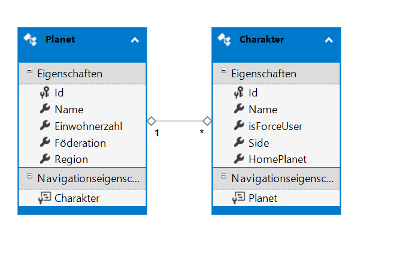
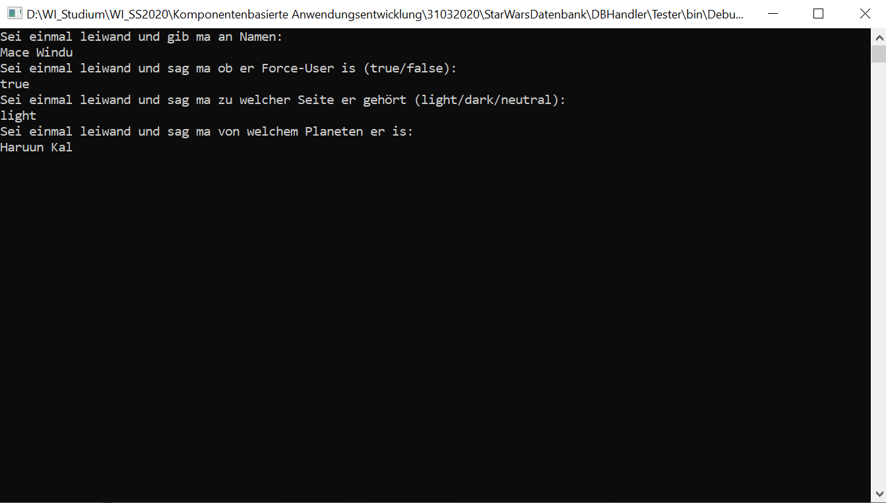
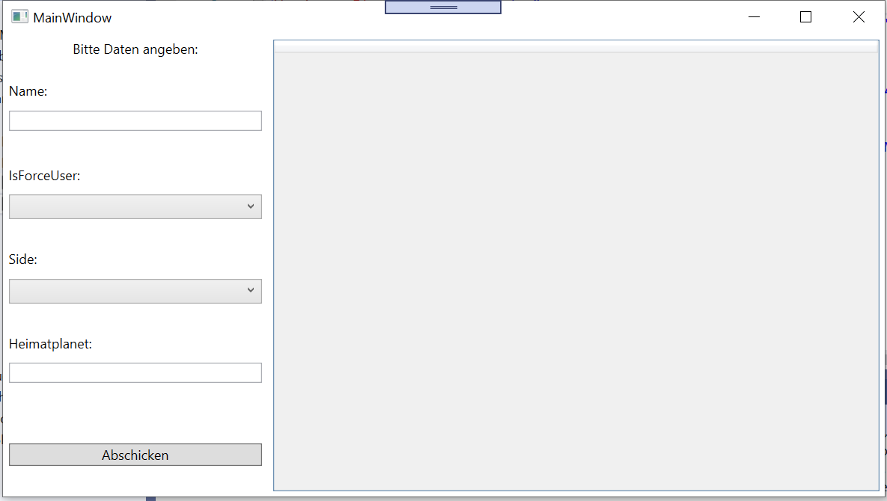

# Star Wars-ish DB Handling

Another Side-Project with C#.
In this Project, I want to create a SQL-Database, and handle the Data inside with a WPF-Application using the MVVM Pattern.

## Libraries:

I'm using the following NuGet Packages:

- EntityFramework (V 6.2.0) from Microsoft
- MVVMLight (V. 5.4.1.1) from GalaSoft

## How it works:

You've got 2 Tables, one for Characters, one for Planets:

A "Tester"-Console-Applications was created to check if everything works.
You can add needed Data in the Console:

If everything worked the Console returns a List of all Characters from the Database:

Character was added to Database:

If the given Planet did not exist before, it's added as a new Planet:

## Todo

WPF needs to to be connected:
In the WPF-Application you're basically able to to the same but with an Interface:

